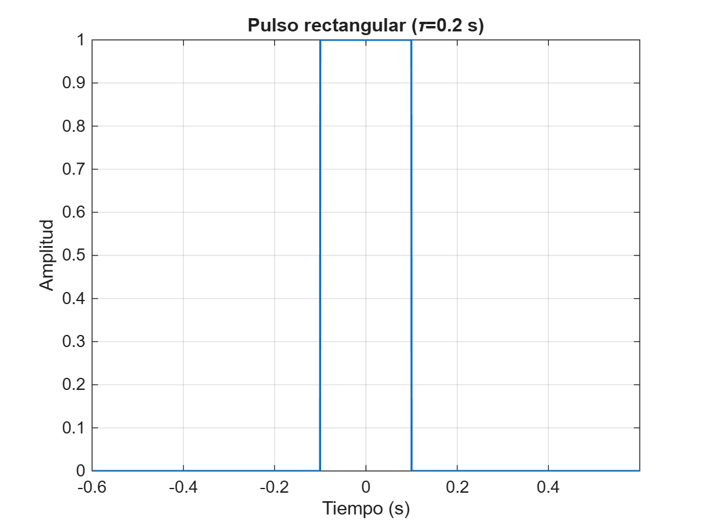
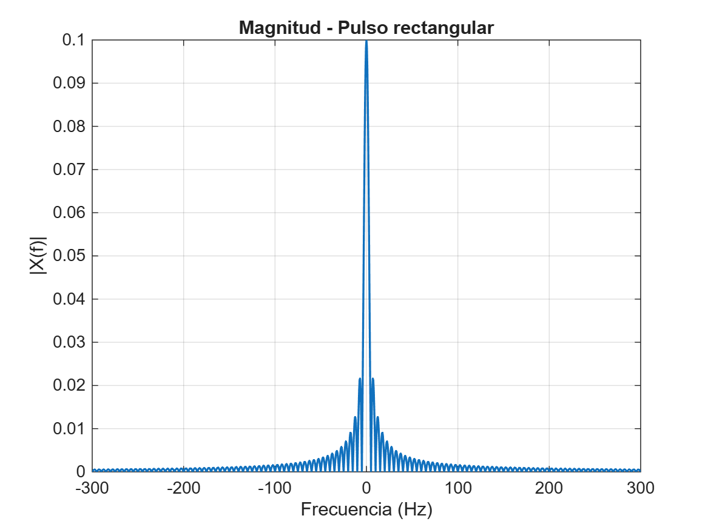
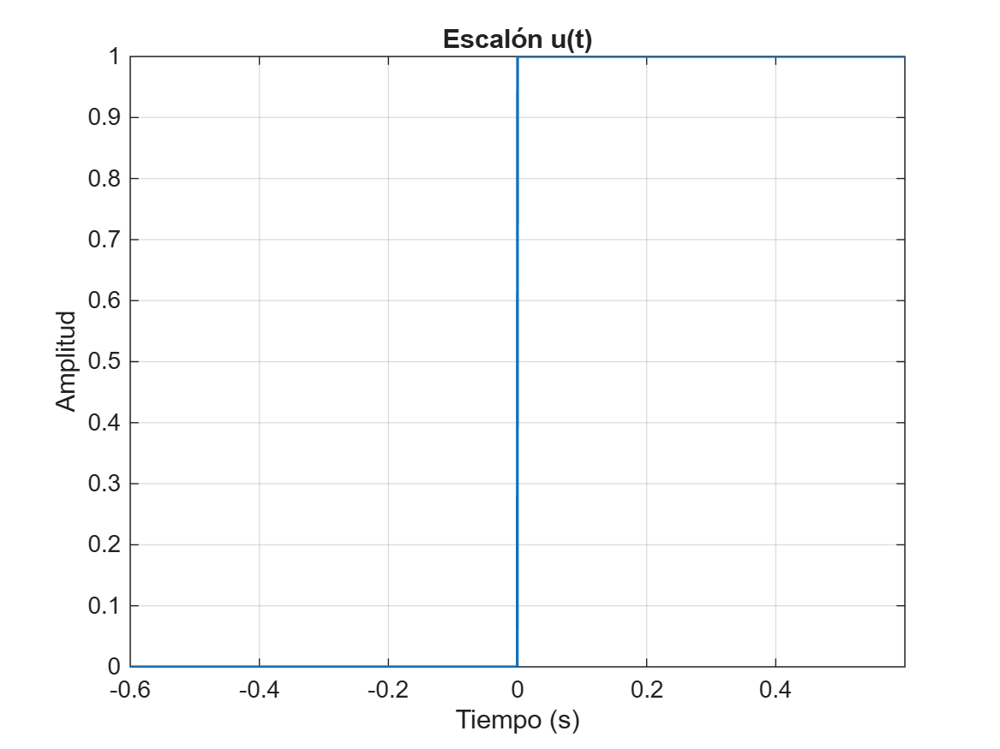
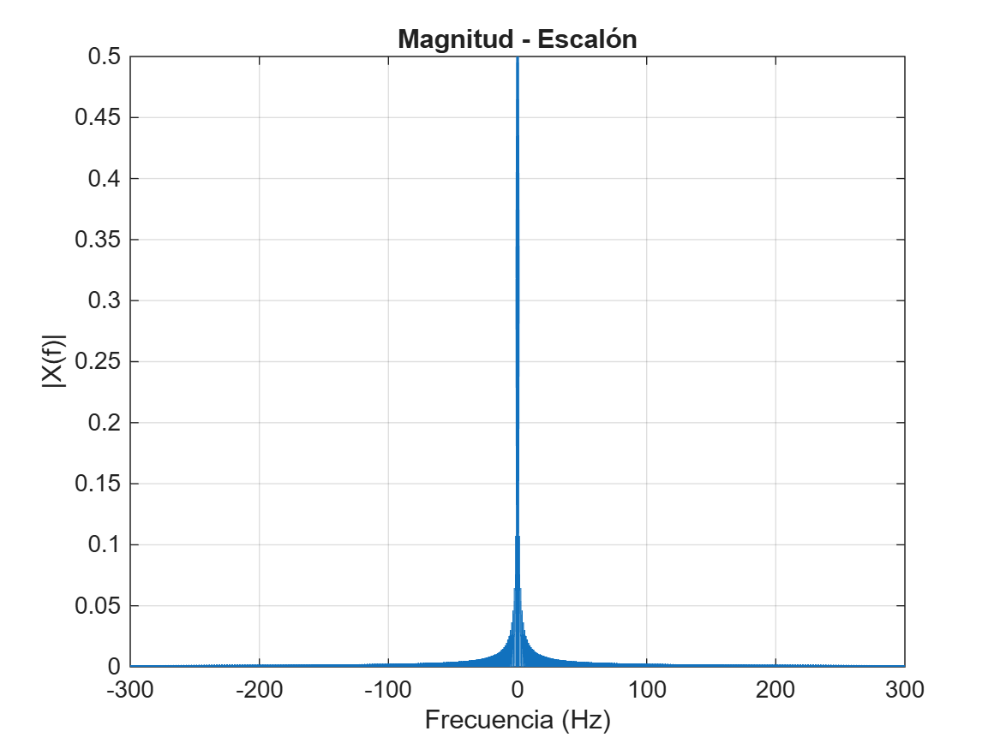
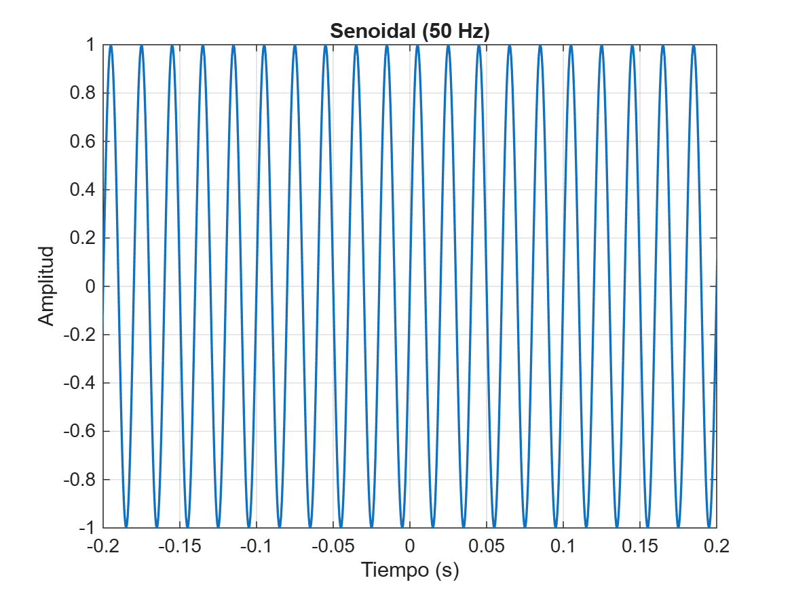
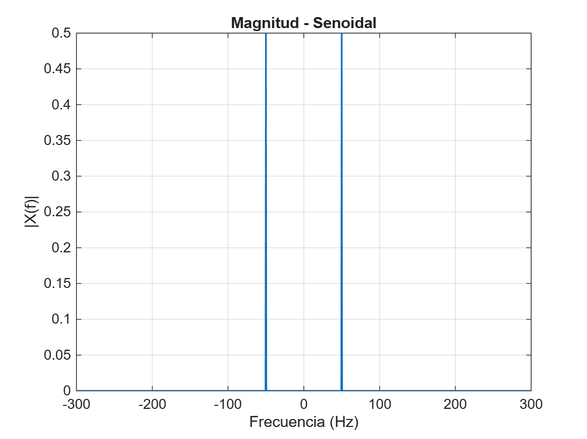
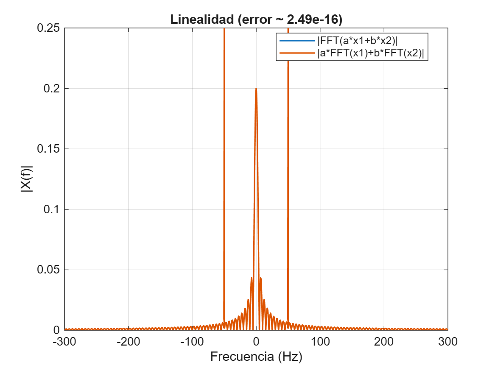
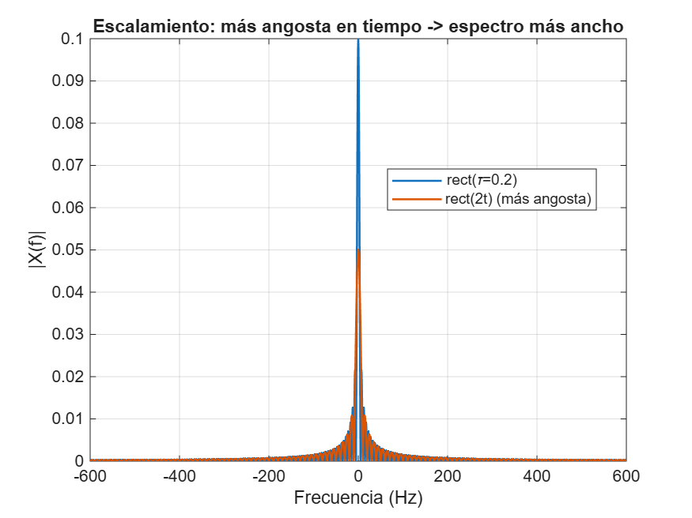
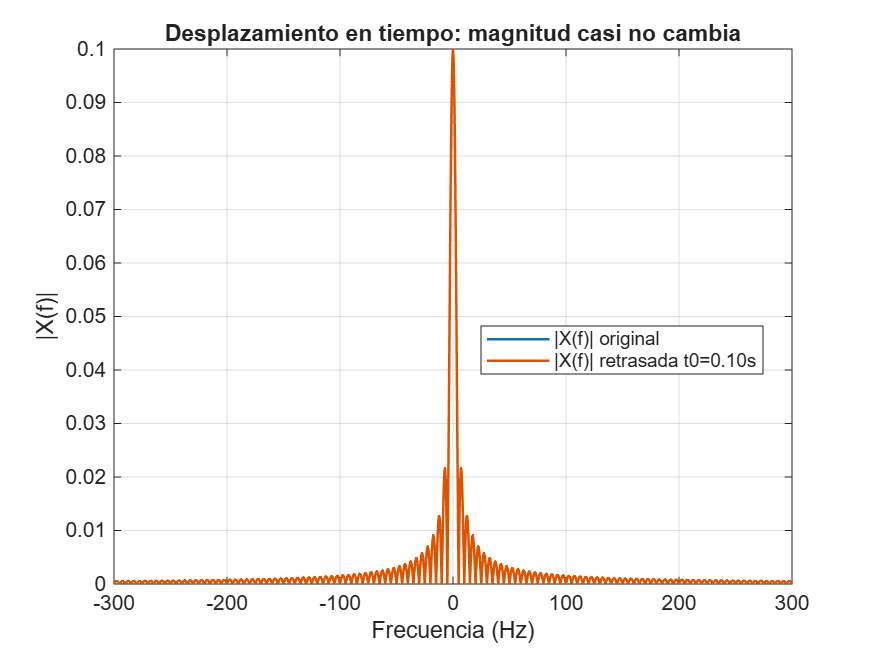

# Análisis de la Transformada de Fourier en MATLAB

Proyecto académico donde se analiza la Transformada de Fourier de señales básicas:

- Pulso rectangular
- Escalón unitario
- Señal senoidal
- Propiedades: Linealidad, Escalamiento y Desplazamiento

---

## Pulso Rectangular

---

## Escalón Unitario

---

## Señal Senoidal

---

## Propiedad de Linealidad

---

## Propiedad de Escalamiento

---

## Propiedad de Desplazamiento

